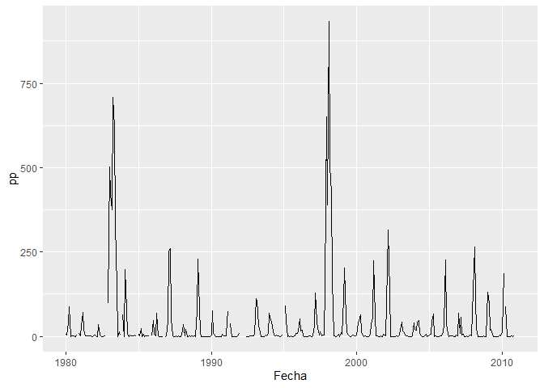
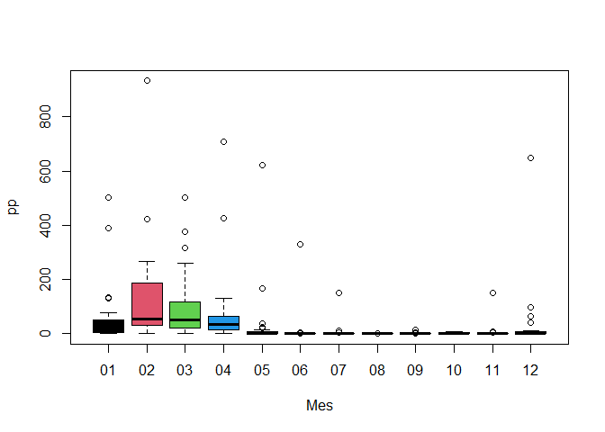
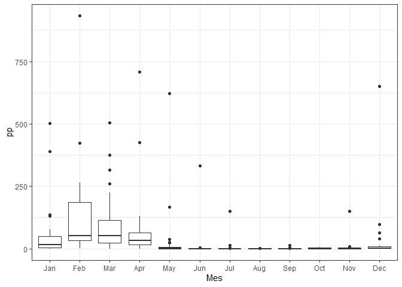

Ejercicios3
================
Grupo 3 - BNicasio
7/2/2021

# Ejercicios Parte 3

## 15\. Manipule los dataframe según se solicite

Se tiene el conjuntos de datos de precipitación diaria (período 1980 -
2013) de ciertas estaciones meteorológicas (**raingaugeDataset.csv**),
donde cada una de estas están asociadas a un código único (**p.e.
qc00000208**). Asimismo, se tiene una lista con los nombres, códigos,
coordenadas y elevación de cada una de las estaciones
(**listRaingauge.csv**). A cada grupo le corresponde la siguiente
estación:

  - **Grupo 01**: MALLARES
  - **Grupo 02**: TABACONAS
  - **Grupo 03**: PUERTO PIZARRO
  - **Grupo 04**: MORROPON
  - **Grupo 05**: SAN MIGUEL
  - **Grupo 06**: CHULUCANAS
  - **Grupo 07**: LAMBAYEQUE
  - **Grupo 08**: EL LIMON
  - **Grupo 09**: EL SALTO
  - **Grupo 10**: CHUSIS

De lo descrito anteriormente, se solicita:

``` r
#Código de estacion de trabajo
dat
```

    ## # A tibble: 1 x 1
    ##   CODIGO    
    ##   <chr>     
    ## 1 qc00000132

``` r
#Seleccionamosla estacion, cambio de nombres (Estacion, Date)
tibble(estacion)
```

    ## # A tibble: 12,419 x 2
    ##    Fecha         pp
    ##    <date>     <dbl>
    ##  1 1980-01-01   0  
    ##  2 1980-01-02   0  
    ##  3 1980-01-03   0  
    ##  4 1980-01-04   0.8
    ##  5 1980-01-05   0  
    ##  6 1980-01-06   0  
    ##  7 1980-01-07   0  
    ##  8 1980-01-08   0  
    ##  9 1980-01-09   0  
    ## 10 1980-01-10   0  
    ## # ... with 12,409 more rows

    ## [1] 12419

-----

1)  Determine la cantidad de **missing values** de la serie de tiempo a
    paso diario.

<!-- end list -->

``` r
tibble::tibble(ppDay) %>% 
  select(2:21) %>% 
  summarise_all(funs(sum(is.na(.)))) # Cntidad "NA"por cada estacion 
```

    ## # A tibble: 1 x 20
    ##   qc00000132 qc00000135 qc00000207 qc00000208 qc00000211 qc00000219 qc00000230
    ##        <int>      <int>      <int>      <int>      <int>      <int>      <int>
    ## 1        329        490        878        558         62         62        586
    ## # ... with 13 more variables: qc00000231 <int>, qc00000235 <int>,
    ## #   qc00000237 <int>, qc00000238 <int>, qc00000240 <int>, qc00000241 <int>,
    ## #   qc00000247 <int>, qc00000248 <int>, qc00000250 <int>, qc00000255 <int>,
    ## #   qc00000278 <int>, qc00000281 <int>, qc00000301 <int>

``` r
#summarise_all(ppDay, funs(sum(is.na(.)))) #Cantidad NA por cada columna
sum(summarise_all(estacion, funs(sum(is.na(.)))))  #Total de "NA" en la estacion "Puerto Pizarro"
```

    ## [1] 329

2)  Calcule la serie de tiempo de precipitación **acumulada mensual**
    (si el \# de días con missing values, en un mes, supera el 10%, la
    precipitación acumulada mensual será considerado como un **`NA`**).

<!-- end list -->

    ## # A tibble: 408 x 4
    ##    Fecha         pp missVal Mes  
    ##    <date>     <dbl>   <dbl> <chr>
    ##  1 1980-01-01   6.9    0    01   
    ##  2 1980-02-01   4.6    0    02   
    ##  3 1980-03-01  39.3    0    03   
    ##  4 1980-04-01  87.3    0    04   
    ##  5 1980-05-01   0      3.23 05   
    ##  6 1980-06-01   0.3    0    06   
    ##  7 1980-07-01   0.5    0    07   
    ##  8 1980-08-01   0.6    0    08   
    ##  9 1980-09-01   0      0    09   
    ## 10 1980-10-01   4.7    0    10   
    ## # ... with 398 more rows

3)  Determine la cantidad de **missing values** de la serie de tiempo a
    paso mensual.

<!-- end list -->

    ## [1] 15

4)  Cree una función que calcule, a partir de los datos de preicpitación
    mensual, la **climatología (Ene-Dic)** para el **período
    1980-2010**.
    <!-- -->
5)  Poltear (boxplot) la variabilidad de los valores mensuales (Ene-Dic)
    para el período 1980-2013.

<!-- end list -->

    ## # A tibble: 408 x 4
    ##    Fecha         pp missVal Mes  
    ##    <date>     <dbl>   <dbl> <chr>
    ##  1 1980-01-01   6.9    0    01   
    ##  2 1980-02-01   4.6    0    02   
    ##  3 1980-03-01  39.3    0    03   
    ##  4 1980-04-01  87.3    0    04   
    ##  5 1980-05-01   0      3.23 05   
    ##  6 1980-06-01   0.3    0    06   
    ##  7 1980-07-01   0.5    0    07   
    ##  8 1980-08-01   0.6    0    08   
    ##  9 1980-09-01   0      0    09   
    ## 10 1980-10-01   4.7    0    10   
    ## # ... with 398 more rows

<!-- --><!-- -->
