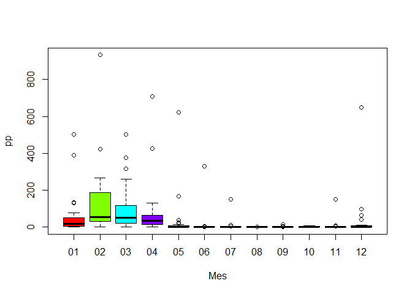

Ejercicios\_Practica\_1
================
Grupo 3
7/11/2021

| Nro | Integrante                 |
| --- | -------------------------- |
| 1   | Nicasio Castañeda Brayan   |
| 2   | Palomino Torres Fiorella   |
| 3   | Torre Sulca Stefany Nicole |
| 4   | Zumarán Miranda Daniel     |

# EJERCICIOS PARTE 1

Cargar las variables almacenadas en el siguiente archivo
[Rdata](https://goo.gl/uDzU8v)

### 1\. Calcula los valores numéricos aproximados de:

1)  \(\frac{0.3 \cdot 0.15}{0.3 \cdot 0.15 + 0.2 \cdot 0.8 + 0.5 \cdot 0.12}\)

<!-- end list -->

``` r
a<- (0.3*0.5)/(0.3*0.15+0.2*0.8+0.5*0.12)
a #eval: muestra respuesta, echo: muestra procedimiento
```

    ## [1] 0.5660377

2)  \(\frac{5^6}{6!} e^{-5}\)

<!-- end list -->

``` r
b<-(exp(-5)*5**6)/factorial(6)
b
```

    ## [1] 0.1462228

3)  \(\begin{pmatrix} 20 \\ 7 \end{pmatrix} 0.4^7 0.6^{13}\)

<!-- end list -->

``` r
c<-choose(20,7)*(0.4**7)*(0.6**13)
c
```

    ## [1] 0.1658823

### 2\. Realizar la siguiente suma

1)  \(1+2+3+...+1000\)

<!-- end list -->

``` r
sum(1:1000)
```

    ## [1] 500500

2)  \(1+2+4+8+16+...+1024\)

<!-- end list -->

``` r
sum(seq(2,1024,2))       #Creamos una secuencia cada "2" y sumamos
```

    ## [1] 262656

### 3\. El vector `grupo` representa el grupo al que pertenece una serie de alumnos

1)  ¿Cuántos elementos tiene?

<!-- end list -->

``` r
tibble(grupo) %>%            #Cantidad de datos
  count()
```

    ## # A tibble: 1 x 1
    ##       n
    ##   <int>
    ## 1   192

2)  ¿En qué posiciones del vector está la letra “A”?

<!-- end list -->

``` r
tibble(grupo) %>% 
  mutate(orden = 1:n(), grupo = grupo) %>% #Agregamos una columna de posicion
  filter(grupo == "A")                     #Filtramos solo "A"
```

    ## # A tibble: 14 x 2
    ##    grupo orden
    ##    <chr> <int>
    ##  1 A         2
    ##  2 A         8
    ##  3 A        17
    ##  4 A        21
    ##  5 A        28
    ##  6 A        84
    ##  7 A       101
    ##  8 A       108
    ##  9 A       111
    ## 10 A       115
    ## 11 A       123
    ## 12 A       136
    ## 13 A       190
    ## 14 A       192

### 4\. El vector `nota` representa la nota de un examen de los alumnos que están en los grupos del vector `grupo`.

1)  ¿Cuanto suman todas las notas?

<!-- end list -->

``` r
sum(nota)                            #Sumamos las notas
```

    ## [1] 962

2)  ¿Cual es la media aritmética de todas las notas?

<!-- end list -->

``` r
median(nota)                         #Media de las notas
```

    ## [1] 5

3)  ¿En qué posiciones están las notas mayores de *7.0*?

<!-- end list -->

``` r
tibble(nota) %>% 
  mutate(orden = 1:n() , nota =nota) %>% #Agregamos una columna de posicion
  filter(nota>7)                         #Notas mayores de "7"
```

    ## # A tibble: 4 x 2
    ##    nota orden
    ##   <dbl> <int>
    ## 1   7.2    81
    ## 2   7.4   103
    ## 3   7.7   120
    ## 4   7.5   151

4)  Visualiza las notas ordenadas de mayor a menor

<!-- end list -->

``` r
tibble(grupo,nota) %>%                   #Unimos "Grupo" y "Nota"
  arrange(nota) %>%                     #Ordenamos de mmenor a mayor NOTAS
  mutate(Orden = 1:n())                 #Agregamos posicion
```

    ## # A tibble: 192 x 3
    ##    grupo  nota Orden
    ##    <chr> <dbl> <int>
    ##  1 B       1.7     1
    ##  2 D       2.5     2
    ##  3 D       2.6     3
    ##  4 E       2.7     4
    ##  5 E       2.9     5
    ##  6 D       2.9     6
    ##  7 A       2.9     7
    ##  8 E       3       8
    ##  9 E       3.1     9
    ## 10 C       3.2    10
    ## # ... with 182 more rows

5)  ¿En qué posición está la nota máxima?

<!-- end list -->

``` r
tibble(nota) %>% 
  mutate(orden = 1:n() , nota =nota) %>%   #Agregamos posicion
  slice_max(nota)                         #Seleccionamos la maxima "Nota"
```

    ## # A tibble: 1 x 2
    ##    nota orden
    ##   <dbl> <int>
    ## 1   7.7   120

### 5\. A partir de los vectores `grupo` y `nota` definidos.

1)  Suma las notas de los 10 primeros alumnos del vector

<!-- end list -->

``` r
sum(nota[1:10])                             #Sumamos los primeros 10
```

    ## [1] 51.8

2)  ¿Cuántos alumnos hay del grupo *C*?

<!-- end list -->

``` r
tibble(grupo) %>% 
  filter(grupo == "C") %>%                 #Filtramos solo "C"
  count()                                  #Contamos
```

    ## # A tibble: 1 x 1
    ##       n
    ##   <int>
    ## 1    39

3)  ¿Cuántos alumnos han aprobado?

<!-- end list -->

``` r
tibble(nota) %>% 
  filter(nota >= 5.1) %>%                 #Filtramos solo "C"
  count()                                  #Contamos
```

    ## # A tibble: 1 x 1
    ##       n
    ##   <int>
    ## 1    93

4)  ¿Cuántos alumnos del grupo *B* han aprobado?

<!-- end list -->

``` r
tibble(grupo, nota) %>% 
  filter(nota >= 5.1 ,grupo == "B") %>%   #Filtramos Aprobado y solo "B"
  count() 
```

    ## # A tibble: 1 x 1
    ##       n
    ##   <int>
    ## 1    10

5)  ¿Qué porcentaje de alumnos del grupo *C* han aprobado?

<!-- end list -->

``` r
(tibble(grupo, nota) %>%
  filter(nota >= 5.1 ,grupo == "C") %>%   #Filtramos Aprobado y solo "B"
  count()/tibble(grupo) %>%
  filter(grupo == "C") %>%   #Filtramos solo "C"
  count())*100
```

    ##          n
    ## 1 56.41026

6)  ¿De qué grupos son la máxima y mínima notas de toda la muestra?

<!-- end list -->

``` r
tibble(grupo,nota) %>%    
  slice_max(nota)      #Maxima nota
```

    ## # A tibble: 1 x 2
    ##   grupo  nota
    ##   <chr> <dbl>
    ## 1 E       7.7

``` r
tibble(grupo,nota) %>%    
  slice_min(nota)      #Minima nota
```

    ## # A tibble: 1 x 2
    ##   grupo  nota
    ##   <chr> <dbl>
    ## 1 B       1.7

7)  Nota media de los alumnos de grupo *A* y *B*, juntos, considerando
    sólo a los que han aprobado.

<!-- end list -->

``` r
tibble(grupo, nota) %>% 
  filter(grupo == "A" & nota > 5|         #Grupo A y Aprobado
         grupo == "B" & nota > 5) %>%     #Grupo B y Aprobado
  summarise(mean(nota))                   #Media
```

    ## # A tibble: 1 x 1
    ##   `mean(nota)`
    ##          <dbl>
    ## 1         5.94

### 6\. Calcula el percentil 66 de las notas de todos los alumnos, y también de los alumnos del grupo C.

``` r
quantile(nota, c(0.66))    #Percentil 66
```

    ## 66% 
    ## 5.5

``` r
tibble(grupo, nota) %>% 
  filter(grupo == "C") %>%       #Filtramos solo C
  summarise(quantile(nota, c(0.66)))  #Percentil 66
```

    ## # A tibble: 1 x 1
    ##   `quantile(nota, c(0.66))`
    ##                       <dbl>
    ## 1                      5.81

### 7\. Un alumno tiene una nota de 4.9. ¿Qué porcentaje, del total de alumnos, tiene una nota menor o igual que la suya? ¿Y qué porcentaje tiene una nota mayor o igual que la suya?

``` r
(tibble(nota) %>%
  filter(nota <= 4.9) %>%   #Filtramos Nota menor a 4.9
  count()/tibble(grupo) %>%
  count())*100   
```

    ##        n
    ## 1 46.875

``` r
(tibble(nota) %>%
  filter(nota >= 4.9) %>%   #Filtramos Nota mayor a 4.9
  count()/tibble(grupo) %>%
  count())*100  
```

    ##       n
    ## 1 56.25

### 8\. Realiza el gráfico de diagramas de caja de las notas de cada grupo, para poder comparar el nivel de cada uno de ellos.

``` r
df<- tibble(grupo,nota)
boxplot(`nota` ~ `grupo`,df, col = palette(rainbow(4)))
```

<!-- -->

### 9\. Si la variable `conc` recoge la concentración de plomo (en ppm) en el aire de cierta zona durante un día completo.

1)  ¿Cuál ha sido la concentración máxima?

<!-- end list -->

``` r
tibble(conc) %>% 
  slice_max(conc)
```

    ## # A tibble: 1 x 1
    ##    conc
    ##   <dbl>
    ## 1  47.3

2)  ¿En cuántos de los muestreos se ha superado la concentración de 40.0
    ppm?

<!-- end list -->

``` r
tibble(conc) %>% 
  filter(conc > 40) %>% 
  count()
```

    ## # A tibble: 1 x 1
    ##       n
    ##   <int>
    ## 1    61

3)  ¿Cuál ha sido la concentración media del día?

<!-- end list -->

``` r
tibble(conc) %>% 
  summarise(median(conc))
```

    ## # A tibble: 1 x 1
    ##   `median(conc)`
    ##            <dbl>
    ## 1           24.4

4)  ¿Cuáles fueron las 10 mediciones más bajas del día?

<!-- end list -->

``` r
tibble(conc) %>%                   #Unimos "Grupo" y "Nota"
  arrange(conc)
```

    ## # A tibble: 288 x 1
    ##     conc
    ##    <dbl>
    ##  1  0.93
    ##  2  1.07
    ##  3  1.77
    ##  4  2.03
    ##  5  2.58
    ##  6  2.73
    ##  7  2.75
    ##  8  2.88
    ##  9  2.88
    ## 10  2.91
    ## # ... with 278 more rows

5)  Si la primera medida fue a las 00:00. ¿A qué hora del día se alcanzó
    la concentración máxima?

<!-- end list -->

``` r
#Hora<- seq(0,24-1/12,1/12)
Hora<-seq(as.POSIXct("2020-01-01 00:00"),as.POSIXct("2020-01-01 23:55"),by="5 min") #Secuencia cada 5 minutos
length(Hora)
```

    ## [1] 288

``` r
tibble(Hora,conc) %>%   #Unimos Hora y CONC
  slice_max(conc)       #Encontramos el valor maximo
```

    ## # A tibble: 1 x 2
    ##   Hora                 conc
    ##   <dttm>              <dbl>
    ## 1 2020-01-01 11:45:00  47.3

``` r
#seq(as.double())
seq(as.POSIXct("2020-01-01 00:00"),as.POSIXct("2020-01-01 23:00"),by="5 min")
```

    ##   [1] "2020-01-01 00:00:00 -05" "2020-01-01 00:05:00 -05"
    ##   [3] "2020-01-01 00:10:00 -05" "2020-01-01 00:15:00 -05"
    ##   [5] "2020-01-01 00:20:00 -05" "2020-01-01 00:25:00 -05"
    ##   [7] "2020-01-01 00:30:00 -05" "2020-01-01 00:35:00 -05"
    ##   [9] "2020-01-01 00:40:00 -05" "2020-01-01 00:45:00 -05"
    ##  [11] "2020-01-01 00:50:00 -05" "2020-01-01 00:55:00 -05"
    ##  [13] "2020-01-01 01:00:00 -05" "2020-01-01 01:05:00 -05"
    ##  [15] "2020-01-01 01:10:00 -05" "2020-01-01 01:15:00 -05"
    ##  [17] "2020-01-01 01:20:00 -05" "2020-01-01 01:25:00 -05"
    ##  [19] "2020-01-01 01:30:00 -05" "2020-01-01 01:35:00 -05"
    ##  [21] "2020-01-01 01:40:00 -05" "2020-01-01 01:45:00 -05"
    ##  [23] "2020-01-01 01:50:00 -05" "2020-01-01 01:55:00 -05"
    ##  [25] "2020-01-01 02:00:00 -05" "2020-01-01 02:05:00 -05"
    ##  [27] "2020-01-01 02:10:00 -05" "2020-01-01 02:15:00 -05"
    ##  [29] "2020-01-01 02:20:00 -05" "2020-01-01 02:25:00 -05"
    ##  [31] "2020-01-01 02:30:00 -05" "2020-01-01 02:35:00 -05"
    ##  [33] "2020-01-01 02:40:00 -05" "2020-01-01 02:45:00 -05"
    ##  [35] "2020-01-01 02:50:00 -05" "2020-01-01 02:55:00 -05"
    ##  [37] "2020-01-01 03:00:00 -05" "2020-01-01 03:05:00 -05"
    ##  [39] "2020-01-01 03:10:00 -05" "2020-01-01 03:15:00 -05"
    ##  [41] "2020-01-01 03:20:00 -05" "2020-01-01 03:25:00 -05"
    ##  [43] "2020-01-01 03:30:00 -05" "2020-01-01 03:35:00 -05"
    ##  [45] "2020-01-01 03:40:00 -05" "2020-01-01 03:45:00 -05"
    ##  [47] "2020-01-01 03:50:00 -05" "2020-01-01 03:55:00 -05"
    ##  [49] "2020-01-01 04:00:00 -05" "2020-01-01 04:05:00 -05"
    ##  [51] "2020-01-01 04:10:00 -05" "2020-01-01 04:15:00 -05"
    ##  [53] "2020-01-01 04:20:00 -05" "2020-01-01 04:25:00 -05"
    ##  [55] "2020-01-01 04:30:00 -05" "2020-01-01 04:35:00 -05"
    ##  [57] "2020-01-01 04:40:00 -05" "2020-01-01 04:45:00 -05"
    ##  [59] "2020-01-01 04:50:00 -05" "2020-01-01 04:55:00 -05"
    ##  [61] "2020-01-01 05:00:00 -05" "2020-01-01 05:05:00 -05"
    ##  [63] "2020-01-01 05:10:00 -05" "2020-01-01 05:15:00 -05"
    ##  [65] "2020-01-01 05:20:00 -05" "2020-01-01 05:25:00 -05"
    ##  [67] "2020-01-01 05:30:00 -05" "2020-01-01 05:35:00 -05"
    ##  [69] "2020-01-01 05:40:00 -05" "2020-01-01 05:45:00 -05"
    ##  [71] "2020-01-01 05:50:00 -05" "2020-01-01 05:55:00 -05"
    ##  [73] "2020-01-01 06:00:00 -05" "2020-01-01 06:05:00 -05"
    ##  [75] "2020-01-01 06:10:00 -05" "2020-01-01 06:15:00 -05"
    ##  [77] "2020-01-01 06:20:00 -05" "2020-01-01 06:25:00 -05"
    ##  [79] "2020-01-01 06:30:00 -05" "2020-01-01 06:35:00 -05"
    ##  [81] "2020-01-01 06:40:00 -05" "2020-01-01 06:45:00 -05"
    ##  [83] "2020-01-01 06:50:00 -05" "2020-01-01 06:55:00 -05"
    ##  [85] "2020-01-01 07:00:00 -05" "2020-01-01 07:05:00 -05"
    ##  [87] "2020-01-01 07:10:00 -05" "2020-01-01 07:15:00 -05"
    ##  [89] "2020-01-01 07:20:00 -05" "2020-01-01 07:25:00 -05"
    ##  [91] "2020-01-01 07:30:00 -05" "2020-01-01 07:35:00 -05"
    ##  [93] "2020-01-01 07:40:00 -05" "2020-01-01 07:45:00 -05"
    ##  [95] "2020-01-01 07:50:00 -05" "2020-01-01 07:55:00 -05"
    ##  [97] "2020-01-01 08:00:00 -05" "2020-01-01 08:05:00 -05"
    ##  [99] "2020-01-01 08:10:00 -05" "2020-01-01 08:15:00 -05"
    ## [101] "2020-01-01 08:20:00 -05" "2020-01-01 08:25:00 -05"
    ## [103] "2020-01-01 08:30:00 -05" "2020-01-01 08:35:00 -05"
    ## [105] "2020-01-01 08:40:00 -05" "2020-01-01 08:45:00 -05"
    ## [107] "2020-01-01 08:50:00 -05" "2020-01-01 08:55:00 -05"
    ## [109] "2020-01-01 09:00:00 -05" "2020-01-01 09:05:00 -05"
    ## [111] "2020-01-01 09:10:00 -05" "2020-01-01 09:15:00 -05"
    ## [113] "2020-01-01 09:20:00 -05" "2020-01-01 09:25:00 -05"
    ## [115] "2020-01-01 09:30:00 -05" "2020-01-01 09:35:00 -05"
    ## [117] "2020-01-01 09:40:00 -05" "2020-01-01 09:45:00 -05"
    ## [119] "2020-01-01 09:50:00 -05" "2020-01-01 09:55:00 -05"
    ## [121] "2020-01-01 10:00:00 -05" "2020-01-01 10:05:00 -05"
    ## [123] "2020-01-01 10:10:00 -05" "2020-01-01 10:15:00 -05"
    ## [125] "2020-01-01 10:20:00 -05" "2020-01-01 10:25:00 -05"
    ## [127] "2020-01-01 10:30:00 -05" "2020-01-01 10:35:00 -05"
    ## [129] "2020-01-01 10:40:00 -05" "2020-01-01 10:45:00 -05"
    ## [131] "2020-01-01 10:50:00 -05" "2020-01-01 10:55:00 -05"
    ## [133] "2020-01-01 11:00:00 -05" "2020-01-01 11:05:00 -05"
    ## [135] "2020-01-01 11:10:00 -05" "2020-01-01 11:15:00 -05"
    ## [137] "2020-01-01 11:20:00 -05" "2020-01-01 11:25:00 -05"
    ## [139] "2020-01-01 11:30:00 -05" "2020-01-01 11:35:00 -05"
    ## [141] "2020-01-01 11:40:00 -05" "2020-01-01 11:45:00 -05"
    ## [143] "2020-01-01 11:50:00 -05" "2020-01-01 11:55:00 -05"
    ## [145] "2020-01-01 12:00:00 -05" "2020-01-01 12:05:00 -05"
    ## [147] "2020-01-01 12:10:00 -05" "2020-01-01 12:15:00 -05"
    ## [149] "2020-01-01 12:20:00 -05" "2020-01-01 12:25:00 -05"
    ## [151] "2020-01-01 12:30:00 -05" "2020-01-01 12:35:00 -05"
    ## [153] "2020-01-01 12:40:00 -05" "2020-01-01 12:45:00 -05"
    ## [155] "2020-01-01 12:50:00 -05" "2020-01-01 12:55:00 -05"
    ## [157] "2020-01-01 13:00:00 -05" "2020-01-01 13:05:00 -05"
    ## [159] "2020-01-01 13:10:00 -05" "2020-01-01 13:15:00 -05"
    ## [161] "2020-01-01 13:20:00 -05" "2020-01-01 13:25:00 -05"
    ## [163] "2020-01-01 13:30:00 -05" "2020-01-01 13:35:00 -05"
    ## [165] "2020-01-01 13:40:00 -05" "2020-01-01 13:45:00 -05"
    ## [167] "2020-01-01 13:50:00 -05" "2020-01-01 13:55:00 -05"
    ## [169] "2020-01-01 14:00:00 -05" "2020-01-01 14:05:00 -05"
    ## [171] "2020-01-01 14:10:00 -05" "2020-01-01 14:15:00 -05"
    ## [173] "2020-01-01 14:20:00 -05" "2020-01-01 14:25:00 -05"
    ## [175] "2020-01-01 14:30:00 -05" "2020-01-01 14:35:00 -05"
    ## [177] "2020-01-01 14:40:00 -05" "2020-01-01 14:45:00 -05"
    ## [179] "2020-01-01 14:50:00 -05" "2020-01-01 14:55:00 -05"
    ## [181] "2020-01-01 15:00:00 -05" "2020-01-01 15:05:00 -05"
    ## [183] "2020-01-01 15:10:00 -05" "2020-01-01 15:15:00 -05"
    ## [185] "2020-01-01 15:20:00 -05" "2020-01-01 15:25:00 -05"
    ## [187] "2020-01-01 15:30:00 -05" "2020-01-01 15:35:00 -05"
    ## [189] "2020-01-01 15:40:00 -05" "2020-01-01 15:45:00 -05"
    ## [191] "2020-01-01 15:50:00 -05" "2020-01-01 15:55:00 -05"
    ## [193] "2020-01-01 16:00:00 -05" "2020-01-01 16:05:00 -05"
    ## [195] "2020-01-01 16:10:00 -05" "2020-01-01 16:15:00 -05"
    ## [197] "2020-01-01 16:20:00 -05" "2020-01-01 16:25:00 -05"
    ## [199] "2020-01-01 16:30:00 -05" "2020-01-01 16:35:00 -05"
    ## [201] "2020-01-01 16:40:00 -05" "2020-01-01 16:45:00 -05"
    ## [203] "2020-01-01 16:50:00 -05" "2020-01-01 16:55:00 -05"
    ## [205] "2020-01-01 17:00:00 -05" "2020-01-01 17:05:00 -05"
    ## [207] "2020-01-01 17:10:00 -05" "2020-01-01 17:15:00 -05"
    ## [209] "2020-01-01 17:20:00 -05" "2020-01-01 17:25:00 -05"
    ## [211] "2020-01-01 17:30:00 -05" "2020-01-01 17:35:00 -05"
    ## [213] "2020-01-01 17:40:00 -05" "2020-01-01 17:45:00 -05"
    ## [215] "2020-01-01 17:50:00 -05" "2020-01-01 17:55:00 -05"
    ## [217] "2020-01-01 18:00:00 -05" "2020-01-01 18:05:00 -05"
    ## [219] "2020-01-01 18:10:00 -05" "2020-01-01 18:15:00 -05"
    ## [221] "2020-01-01 18:20:00 -05" "2020-01-01 18:25:00 -05"
    ## [223] "2020-01-01 18:30:00 -05" "2020-01-01 18:35:00 -05"
    ## [225] "2020-01-01 18:40:00 -05" "2020-01-01 18:45:00 -05"
    ## [227] "2020-01-01 18:50:00 -05" "2020-01-01 18:55:00 -05"
    ## [229] "2020-01-01 19:00:00 -05" "2020-01-01 19:05:00 -05"
    ## [231] "2020-01-01 19:10:00 -05" "2020-01-01 19:15:00 -05"
    ## [233] "2020-01-01 19:20:00 -05" "2020-01-01 19:25:00 -05"
    ## [235] "2020-01-01 19:30:00 -05" "2020-01-01 19:35:00 -05"
    ## [237] "2020-01-01 19:40:00 -05" "2020-01-01 19:45:00 -05"
    ## [239] "2020-01-01 19:50:00 -05" "2020-01-01 19:55:00 -05"
    ## [241] "2020-01-01 20:00:00 -05" "2020-01-01 20:05:00 -05"
    ## [243] "2020-01-01 20:10:00 -05" "2020-01-01 20:15:00 -05"
    ## [245] "2020-01-01 20:20:00 -05" "2020-01-01 20:25:00 -05"
    ## [247] "2020-01-01 20:30:00 -05" "2020-01-01 20:35:00 -05"
    ## [249] "2020-01-01 20:40:00 -05" "2020-01-01 20:45:00 -05"
    ## [251] "2020-01-01 20:50:00 -05" "2020-01-01 20:55:00 -05"
    ## [253] "2020-01-01 21:00:00 -05" "2020-01-01 21:05:00 -05"
    ## [255] "2020-01-01 21:10:00 -05" "2020-01-01 21:15:00 -05"
    ## [257] "2020-01-01 21:20:00 -05" "2020-01-01 21:25:00 -05"
    ## [259] "2020-01-01 21:30:00 -05" "2020-01-01 21:35:00 -05"
    ## [261] "2020-01-01 21:40:00 -05" "2020-01-01 21:45:00 -05"
    ## [263] "2020-01-01 21:50:00 -05" "2020-01-01 21:55:00 -05"
    ## [265] "2020-01-01 22:00:00 -05" "2020-01-01 22:05:00 -05"
    ## [267] "2020-01-01 22:10:00 -05" "2020-01-01 22:15:00 -05"
    ## [269] "2020-01-01 22:20:00 -05" "2020-01-01 22:25:00 -05"
    ## [271] "2020-01-01 22:30:00 -05" "2020-01-01 22:35:00 -05"
    ## [273] "2020-01-01 22:40:00 -05" "2020-01-01 22:45:00 -05"
    ## [275] "2020-01-01 22:50:00 -05" "2020-01-01 22:55:00 -05"
    ## [277] "2020-01-01 23:00:00 -05"

# EJERCICIOS PARTE 2

## 1\. Graficar los puntos

\((1,1),(2,4),(3,6),(4,8),(5,25),(6,36),(7,49),(8,64),(9,81),(10,100)\)
en un plano utilizando RStudio.

``` r
xs<- 1:10
ys<-xs*xs
plot(x = xs, y = ys)
```

<!-- -->

## 2\. Ingresar la matriz A en RStudio

\(A = \begin{pmatrix} 1 & 2 & 3 \\ 2 & 4 & 6 \\ 3 & 6 & 9 \\ 4 & 8 & 12 \end{pmatrix}\)

``` r
A<- matrix(1:12, nrow = 4, ncol = 3 )
A
```

    ##      [,1] [,2] [,3]
    ## [1,]    1    5    9
    ## [2,]    2    6   10
    ## [3,]    3    7   11
    ## [4,]    4    8   12

## 3\. Ingresar la matriz identidad de tamaño 3

\(I = \begin{pmatrix} 1 & 0 & 0 \\ 0 & 1 & 0 \\ 0 & 0 & 1 \end{pmatrix}\)

``` r
I<- diag(3)
I
```

    ##      [,1] [,2] [,3]
    ## [1,]    1    0    0
    ## [2,]    0    1    0
    ## [3,]    0    0    1

## 4\. Crea una función que cree una matriz nula ingresando las dimensiones

``` r
mat<- function(n){  # "n" sera la dimension
  nula<-diag(n);    #diagional = dimension
  for (i in 1:n) {  #
    nula[i,i]=0;
    return(nula)
    
  }
}
mat(4)
```

    ##      [,1] [,2] [,3] [,4]
    ## [1,]    0    0    0    0
    ## [2,]    0    1    0    0
    ## [3,]    0    0    1    0
    ## [4,]    0    0    0    1

## 5\. Modificar la matriz `diag(4)`, para que se parezca a la matriz B

\(B = \begin{pmatrix} 0 & 0 & 0 & 0 \\ 0 & 2 & 0 & 0 \\ 0 & 0 & 3 & 0 \\ 0 & 0 & 0 & 4 \end{pmatrix}\)

``` r
B<-diag(4)
B[1,1]=0
B[2,2]=2
B[3,3]=3
B[4,4]=4
B
```

    ##      [,1] [,2] [,3] [,4]
    ## [1,]    0    0    0    0
    ## [2,]    0    2    0    0
    ## [3,]    0    0    3    0
    ## [4,]    0    0    0    4

## 6\. Obtener la matriz transpuesta de A (ejercicio 2)

``` r
A<- matrix(1:12, nrow = 4, ncol = 3 )
t(A)
```

    ##      [,1] [,2] [,3] [,4]
    ## [1,]    1    2    3    4
    ## [2,]    5    6    7    8
    ## [3,]    9   10   11   12

## 7\. Realizar las siguientes operaciones

\(A + B\), \(A - B\), \(3B\) y \(AB\)

``` r
A<-matrix(c(1:12,rep(0,4)), nrow = 4 , ncol = 4)
B<-matrix(c(0,0,0,0,2,0,0,0,0,3,0,0,0,0,0,4),ncol=4)
(A+B)
```

    ##      [,1] [,2] [,3] [,4]
    ## [1,]    1    7    9    0
    ## [2,]    2    6   13    0
    ## [3,]    3    7   11    0
    ## [4,]    4    8   12    4

``` r
(A-B)
```

    ##      [,1] [,2] [,3] [,4]
    ## [1,]    1    3    9    0
    ## [2,]    2    6    7    0
    ## [3,]    3    7   11    0
    ## [4,]    4    8   12   -4

``` r
(3*B)
```

    ##      [,1] [,2] [,3] [,4]
    ## [1,]    0    6    0    0
    ## [2,]    0    0    9    0
    ## [3,]    0    0    0    0
    ## [4,]    0    0    0   12

``` r
(A*B)
```

    ##      [,1] [,2] [,3] [,4]
    ## [1,]    0   10    0    0
    ## [2,]    0    0   30    0
    ## [3,]    0    0    0    0
    ## [4,]    0    0    0    0

## 8\. Crea una función para calcular \(P^6\)

\(P = \begin{pmatrix} 1 & 2 & 3 \\ -2 & 4 & -2 \\ 1 & 0 & 1 \end{pmatrix}\)

``` r
P<-matrix(c(1,-2,1,2,4,0,3,-2,1),ncol=3)
P
```

    ##      [,1] [,2] [,3]
    ## [1,]    1    2    3
    ## [2,]   -2    4   -2
    ## [3,]    1    0    1

``` r
PM<-function(M,n){
  S=M;
  for(i in 2:n){
    S=S%*%M};
print(S)}
PM(P,6)
```

    ##       [,1]  [,2]  [,3]
    ## [1,] -1792    24 -2824
    ## [2,]  -464 -2416 -1344
    ## [3,]  -648   440  -912

## 9\. Resolver el sistema de ecuaciones

\(3x - y + z = -1\\9x - 2y + z = -9\\3x + y - 2z = -9\)

``` r
sol<- matrix(c(3,9,3,-1,-2,1,1,1,-2), nrow = 3,ncol = 3)
x<- c(-1,-9,-9)
solve(sol,x)
```

    ## [1] -1  2  4

## 10\. Utilizando la ayuda de R, investigue para qué sirven las funciones `eigen()` y `det()`

``` r
# Eigen() Los eigenvectors de una matriz son todos aquellos vectores que, al multiplicarlos por dicha matriz, resultan en el mismo vector o en un múltiplo entero del mismo.
# det() es la determinante
```

## 11\. Considerando las matrices

\[B=\begin{pmatrix} 
1 & 2 & 3 & 4 & 5 \\
2 & 4 & 6 & 8 & 10 \\
3 & 6 & 9 & 12 & 15 \\
4 & 8 & 12 & 16 & 20 \\
5 & 10 & 15 & 20 & 25 \\
6 & 12 & 18 & 24 & 30 \\
7 & 14 & 21 & 28 & 35 \\
8 & 16 & 24 & 32 & 40 \\
9 & 18 & 27 & 36 & 45 \\
10 & 20 & 30 & 40 & 50
\end{pmatrix}\]

\[A = \begin{pmatrix}
  0 & 1 & 0 & 1 & 0 \\
  1 & 0 & 1 & 0 & 1 \\
  0 & 1 & 0 & 1 & 0 \\
  0 & 1 & 0 & 0 & 1 \\
  1 & 0 & 1 & 1 & 0 \\
\end{pmatrix}\] Calcular \(A \cdot B - A B^t\)

``` r
A1<- matrix(1:50,nrow = 10, ncol = 5)
B1<- matrix(c(0,1,0,0,1,1,0,1,1,0,0,1,0,0,1,1,0,1,0,1,0,1,0,1,0),nrow = 5,ncol = 5)
(A1 %*% B1)-(A1 %*% t(B1))
```

    ##       [,1] [,2] [,3] [,4] [,5]
    ##  [1,]   10  -10   10   11  -11
    ##  [2,]   10  -10   10   12  -12
    ##  [3,]   10  -10   10   13  -13
    ##  [4,]   10  -10   10   14  -14
    ##  [5,]   10  -10   10   15  -15
    ##  [6,]   10  -10   10   16  -16
    ##  [7,]   10  -10   10   17  -17
    ##  [8,]   10  -10   10   18  -18
    ##  [9,]   10  -10   10   19  -19
    ## [10,]   10  -10   10   20  -20

## 12\. Considere

\(\hat\beta = (X^t \cdot X)^{-1} \cdot X^t \cdot Y\) Determine la matriz
\(\hat\beta\)
\(x=\begin{pmatrix}1 & 1\\ 1 & -1\\ 1 & 0\\ 1 & 1\\ 1 & 2\\ \end{pmatrix}\)
\(y = \begin{pmatrix}0\\0\\1\\1\\3\\\end{pmatrix}\)

``` r
X<- matrix(c(1,1,1,1,1,1,-1,0,1,2), nrow = 5, ncol = 2)
Y<- matrix(c(0,0,1,1,3), nrow = 5, ncol = 1)
I<- diag(5)
t(X)%*%I%*%Y # %*% MULTIPLICAR matrices
```

    ##      [,1]
    ## [1,]    5
    ## [2,]    7

# Ejercicios Parte 3

## 15\. Manipule los dataframe según se solicite

Se tiene el conjuntos de datos de precipitación diaria (período 1980 -
2013) de ciertas estaciones meteorológicas (**raingaugeDataset.csv**),
donde cada una de estas están asociadas a un código único (**p.e.
qc00000208**). Asimismo, se tiene una lista con los nombres, códigos,
coordenadas y elevación de cada una de las estaciones
(**listRaingauge.csv**). A cada grupo le corresponde la siguiente
estación:

  - **Grupo 01**: MALLARES
  - **Grupo 02**: TABACONAS
  - **Grupo 03**: PUERTO PIZARRO
  - **Grupo 04**: MORROPON
  - **Grupo 05**: SAN MIGUEL
  - **Grupo 06**: CHULUCANAS
  - **Grupo 07**: LAMBAYEQUE
  - **Grupo 08**: EL LIMON
  - **Grupo 09**: EL SALTO
  - **Grupo 10**: CHUSIS

De lo descrito anteriormente, se solicita:

``` r
dat<- tibble(lista) %>% 
  filter(NOM_EST == "PUERTO PIZARRO") %>% #Ubicamos en codigo de la ESTACION
  select(CODIGO)
```

``` r
#Código de estacion de trabajo
dat
```

    ## # A tibble: 1 x 1
    ##   CODIGO    
    ##   <chr>     
    ## 1 qc00000132

``` r
estacion<- tibble(ppDay) %>% 
  select(date, qc00000132) %>%   #Seleccionamos "date" y "Estacion por el codigo"
  mutate(date = as.Date(date, format = "%d/%m/%Y")) %>% #Cambiamos el formato de fecha
  rename(Fecha = date, pp = qc00000132)  #Renombramos
```

``` r
#Seleccionamosla estacion, cambio de nombres (Estacion, Date)
tibble(estacion)
```

    ## # A tibble: 12,419 x 2
    ##    Fecha         pp
    ##    <date>     <dbl>
    ##  1 1980-01-01   0  
    ##  2 1980-01-02   0  
    ##  3 1980-01-03   0  
    ##  4 1980-01-04   0.8
    ##  5 1980-01-05   0  
    ##  6 1980-01-06   0  
    ##  7 1980-01-07   0  
    ##  8 1980-01-08   0  
    ##  9 1980-01-09   0  
    ## 10 1980-01-10   0  
    ## # ... with 12,409 more rows

``` r
#Verificamos los datos
seq(as.Date("1980-01-01"),as.Date("2013-12-31"), by = "day") %>% 
  length()
```

    ## [1] 12419

``` r
estacion<- tibble(ppDay) %>% 
  select(date, qc00000132) %>%   #Seleccionamos "date" y "Estacion por el codigo"
  mutate(date = as.Date(date, format = "%d/%m/%Y")) %>% #Cambiamos el formato de fecha
  rename(Fecha = date, pp = qc00000132) %>%   #Renombramos
  arrange(Fecha)  #Total de datos
#Sale todo BIEN :)
```

-----

1)  Determine la cantidad de **missing values** de la serie de tiempo a
    paso diario.

<!-- end list -->

``` r
tibble::tibble(ppDay) %>% 
  select(2:21) %>% 
  summarise_all(funs(sum(is.na(.)))) # Cntidad "NA"por cada estacion 
```

    ## # A tibble: 1 x 20
    ##   qc00000132 qc00000135 qc00000207 qc00000208 qc00000211 qc00000219 qc00000230
    ##        <int>      <int>      <int>      <int>      <int>      <int>      <int>
    ## 1        329        490        878        558         62         62        586
    ## # ... with 13 more variables: qc00000231 <int>, qc00000235 <int>,
    ## #   qc00000237 <int>, qc00000238 <int>, qc00000240 <int>, qc00000241 <int>,
    ## #   qc00000247 <int>, qc00000248 <int>, qc00000250 <int>, qc00000255 <int>,
    ## #   qc00000278 <int>, qc00000281 <int>, qc00000301 <int>

``` r
#summarise_all(ppDay, funs(sum(is.na(.)))) #Cantidad NA por cada columna
sum(summarise_all(estacion, funs(sum(is.na(.)))))  #Total de "NA" en la estacion "Puerto Pizarro"
```

    ## [1] 329

2)  Calcule la serie de tiempo de precipitación **acumulada mensual**
    (si el \# de días con missing values, en un mes, supera el 10%, la
    precipitación acumulada mensual será considerado como un **`NA`**).

<!-- end list -->

``` r
ppMPizarro<-
  estacion %>% 
  group_by(Fecha = str_sub(Fecha,1,7)) %>% 
  mutate(
    missVal = sum(is.na(pp))*100/n()    #porcentaje de DATOS faltantes
  ) %>% 
  summarise(
    pp = sum(pp, na.rm = T),
    missVal = unique(missVal)          #Precipitacion acumulada
  ) %>% 
  mutate(
    pp = ifelse(missVal>=10,NA,pp),    #NA, cuando superan o son mayor a 10%
    Fecha = as.Date(sprintf("%1$s-01", Fecha)),
    Mes = str_sub(Fecha, 6, 7)
  )
ppMPizarro
```

    ## # A tibble: 408 x 4
    ##    Fecha         pp missVal Mes  
    ##    <date>     <dbl>   <dbl> <chr>
    ##  1 1980-01-01   6.9    0    01   
    ##  2 1980-02-01   4.6    0    02   
    ##  3 1980-03-01  39.3    0    03   
    ##  4 1980-04-01  87.3    0    04   
    ##  5 1980-05-01   0      3.23 05   
    ##  6 1980-06-01   0.3    0    06   
    ##  7 1980-07-01   0.5    0    07   
    ##  8 1980-08-01   0.6    0    08   
    ##  9 1980-09-01   0      0    09   
    ## 10 1980-10-01   4.7    0    10   
    ## # ... with 398 more rows

3)  Determine la cantidad de **missing values** de la serie de tiempo a
    paso mensual.

<!-- end list -->

``` r
sum(summarise_all(ppMPizarro, funs(sum(is.na(.))))) #Punto es para que evalue todo.
```

    ## [1] 15

4)  Cree una función que calcule, a partir de los datos de preicpitación
    mensual, la **climatología (Ene-Dic)** para el **período
    1980-2010**.

<!-- end list -->

``` r
ppM80_10<- tibble(ppDay) %>% 
  select(date, qc00000132) %>%   #Seleccionamos "date" y "Estacion por el codigo"
  mutate(date = as.Date(date, format = "%d/%m/%Y")) %>% #Cambiamos el formato de fecha
  rename(Fecha = date, pp = qc00000132) %>%   #Renombramos
  filter(Fecha>="1980-01-01",Fecha<="2010-12-31") %>%   #SOLO de 1980 a 2010
  group_by(Fecha = str_sub(Fecha,1,7)) %>%   #Agrupamos  por Año y Mes
  mutate(
    missVal = sum(is.na(pp))*100/n()    #porcentaje de DATOS faltantes
  ) %>% 
  summarise(
    pp = sum(pp, na.rm = T),
    missVal = unique(missVal)          #Precipitacion acumulada
  ) %>% 
  mutate(
    pp = ifelse(missVal>=10,NA,pp),    #NA, cuando superan o son mayor a 10%
    Fecha = as.Date(sprintf("%1$s-01", Fecha)),
    Mes = str_sub(Fecha, 6, 7)
  )
ggplot(ppM80_10, aes(Fecha,pp))+
  geom_line()
```

<!-- -->

``` r
#view(ppM80_10)
```

5)  Poltear (boxplot) la variabilidad de los valores mensuales (Ene-Dic)
    para el período 1980-2013.

<!-- end list -->

``` r
ppMPizarro
```

    ## # A tibble: 408 x 4
    ##    Fecha         pp missVal Mes  
    ##    <date>     <dbl>   <dbl> <chr>
    ##  1 1980-01-01   6.9    0    01   
    ##  2 1980-02-01   4.6    0    02   
    ##  3 1980-03-01  39.3    0    03   
    ##  4 1980-04-01  87.3    0    04   
    ##  5 1980-05-01   0      3.23 05   
    ##  6 1980-06-01   0.3    0    06   
    ##  7 1980-07-01   0.5    0    07   
    ##  8 1980-08-01   0.6    0    08   
    ##  9 1980-09-01   0      0    09   
    ## 10 1980-10-01   4.7    0    10   
    ## # ... with 398 more rows

``` r
boxplot(`pp` ~ `Mes`,ppMPizarro, col = palette(rainbow(12)))
```

<!-- -->

``` r
ggplot(ppMPizarro, aes(Mes,pp))+
  geom_boxplot()+
  theme_bw()+
  scale_x_discrete(
    labels = month.abb
  )
```

<!-- -->

``` r
#view(est80_10)
```
